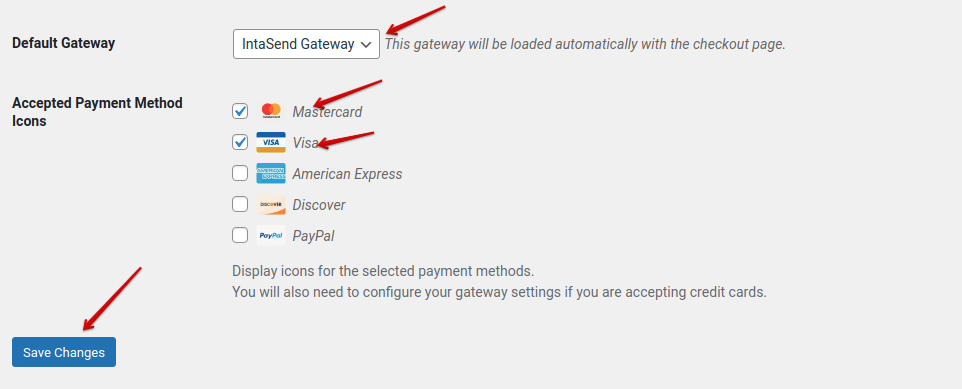

# Easy Digital Download

## How to use IntaSend with Easy Digital Download plugin

[Easy Digital Downloads](https://wordpress.org/plugins/easy-digital-downloads/) is a complete eCommerce solution for selling digital products on WordPress. It enables businesses to easily sell digital products such as papers, e-books, and artwork.

IntaSend has developed and hosted a plugin for Easy Digital Download to make it easy for you to collect both card and mobile payments.

Below is a step-by-step guide on how to get set up.

### 1. Download the plugin

Download the [IntaSend Easy Digital Download plugin](https://intasend-public-share.s3.eu-central-1.amazonaws.com/intasend-gateway-integrate-easy-digital.zip) from the link below:

[https://intasend-public-share.s3.eu-central-1.amazonaws.com/intasend-gateway-integrate-easy-digital.zip](https://intasend-public-share.s3.eu-central-1.amazonaws.com/intasend-gateway-integrate-easy-digital.zip)

### 2. Install the plugin on your site

Log in to your WP admin and upload the plugin zip file.

.png>)

### 3. Activate Plugin&#x20;

Make sure you activate the plugin on the listing site

.png>)

.png>)

### 4. Configure payment settings and add IntaSend API Keys

Under Easy Digital Downloads settings, navigate to payment and configure IntaSend API keys. Obtain the IntaSend keys from the following sites:

Test Keys: https://sandbox.intasend.com

Live Keys: https://payment.intasend.com

After obtaining the publishable API Key, go back to your website admin page and add the keys.

.png>)


Important: Make sure you use the right key as per your environment. Ensure you uncheck the test mode when going live.


Finally, save changes to complete installation. Remember to set IntaSend Gateway as the default payment gateway.

Congratulations - IntaSend will now be used to collect payment. Transactions will also be visible on your IntaSend [dashboard](https://payment.intasend.com).&#x20;

&#x20;
