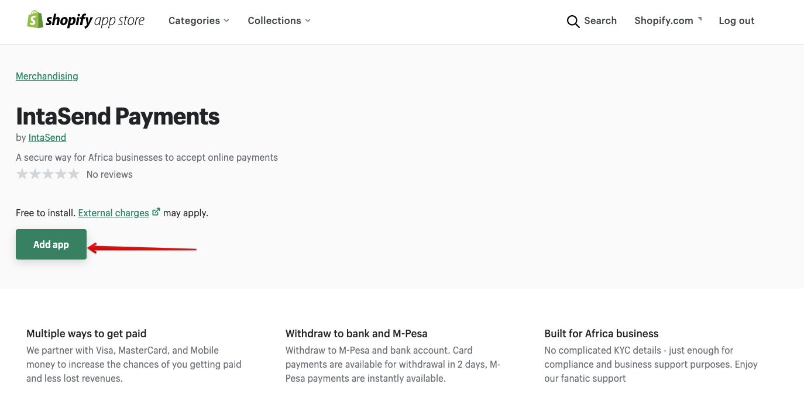
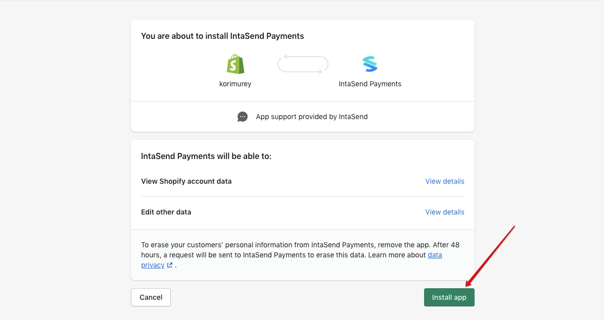
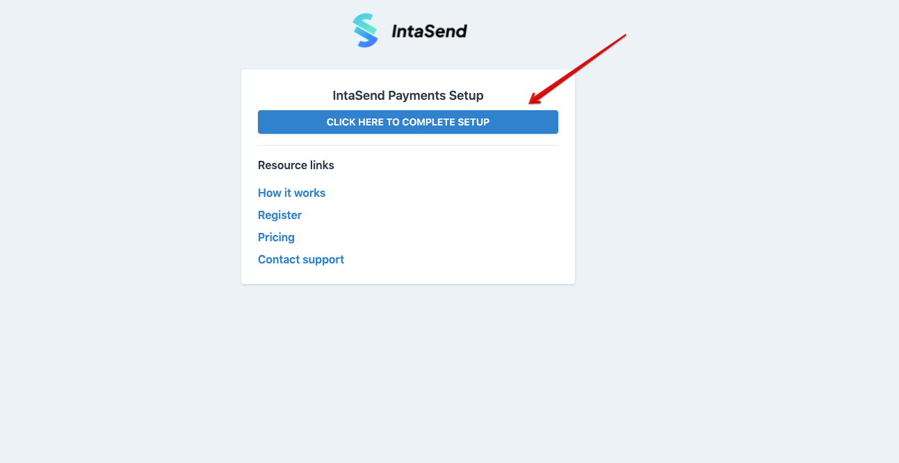
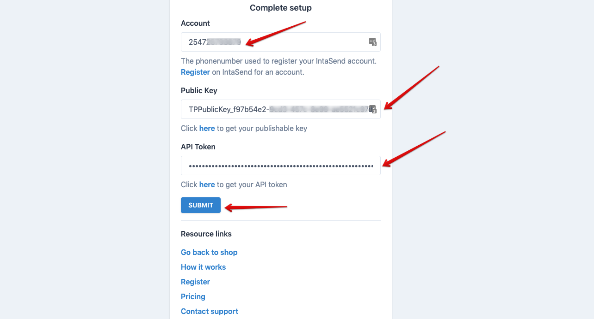
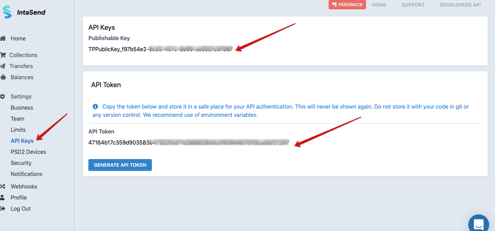
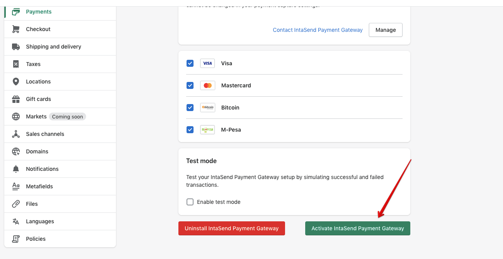
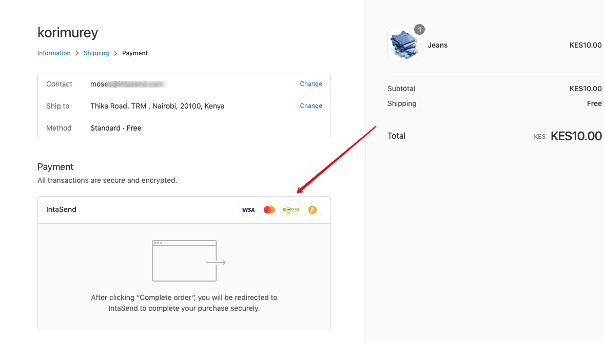

# Shopify

## How to accept M-Pesa, Bitcoin, and Card payments on your Shopify store

IntaSend payment support M-Pesa, Bitcoin, and card payments through its official app and partnership with Shopify which can be accessed here [**https://apps.shopify.com/intasend-payments**](https://apps.shopify.com/intasend-payments)****

IntaSend payments app is free to install, and we charge per transaction. For more details on pricing please go to our [**pricing page**](https://intasend.com/pricing/).&#x20;


End to end presentation on how to set up IntaSend payments and first M-Pesa transaction


### 1. Install IntaSend Payments App to your store

Go to [**https://apps.shopify.com/intasend-payments**](https://apps.shopify.com/intasend-payments) **** and click **Add app** button to get started.

### 2. Authorize and setup Keys

Click install the app to proceed with the setup.

You will be redirected to the IntaSend setup page. Click the complete setup button for setup instructions. We use these settings to link Shopify to your IntaSend account. If you don't have an IntaSend account, use this link to register - [**IntaSend signup**](https://payment.intasend.com/account/signup/).

To complete setup, you'll need the phone number/account used to register at IntaSend (this is the same phone number you use during IntaSend login), the public or publishable key, and an API token (secret key).

All the above keys can be found under your account business - settings - API Keys section.

Copy the publishable key and paste it to the Public key field,  generate the API token and copy the content to the API key section. Note the API key will be revealed once and never made available again. In case you have challenges with the old one, simply click the Generate API Token button for a new one which will automatically replace the old keys.

Click submit and you'll be redirected back to Shopify to complete the setup.

### 3. Activate the payment app

Click the activate button as in the screenshot below to start using IntaSend to accept online payments.&#x20;

When activated, IntaSend Payments will be made available at checkout pages.

Congratulations - You are now set to accept online payments [securely](https://intasend.com/security/) with IntaSend.

### Testing

You might want to test payments without signing up for real accounts, or in case your store is in the development stage. IntaSend supports test mode.&#x20;

#### How to test

1. Put your IntaSend app in **test mode.**
2. Generate test keys from[ **https://sandbox.intasend.com**](https://sandbox.intasend.com) (no signup is required).&#x20;
3. Follow the [**authorize and setup keys step**](shopify.md#2.-authorize-and-setup-keys) above and instead of the live account keys, use the ones from the sandbox environment.
4. Use the test cards from the [**testing page**](../sandbox-and-live-environments.md#test-card-numbers) for demo payment.&#x20;
5. Note: Test mode can only work when the setup keys are from the Sandbox environment. To go back to the live, you must obtain the keys from the live environment - [**https://payment.intasend.com**](https://payment.intasend.com)****
