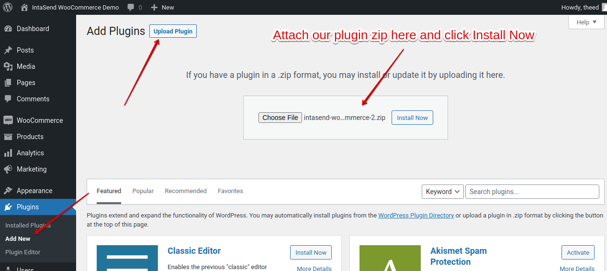
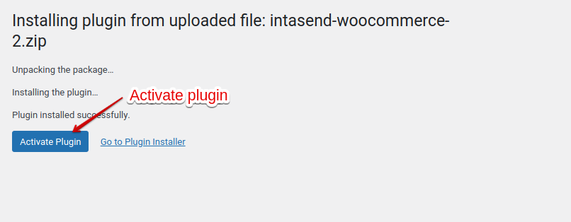
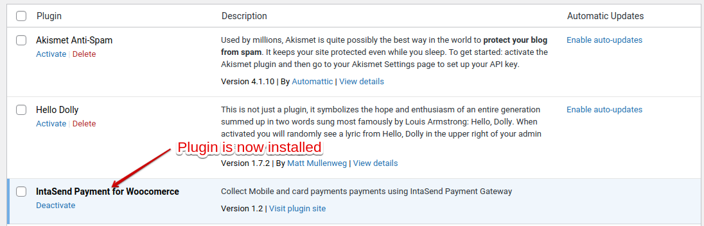
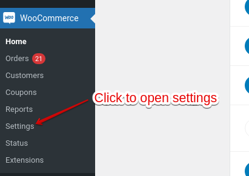
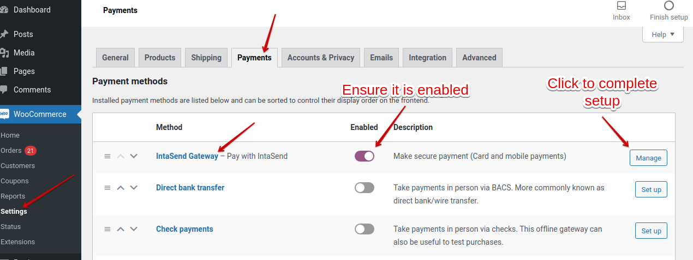
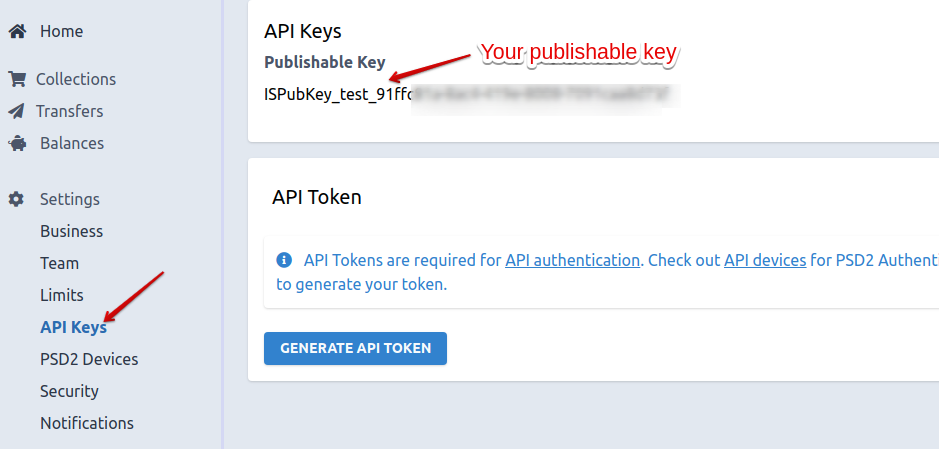
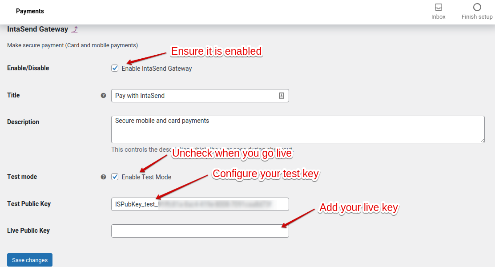
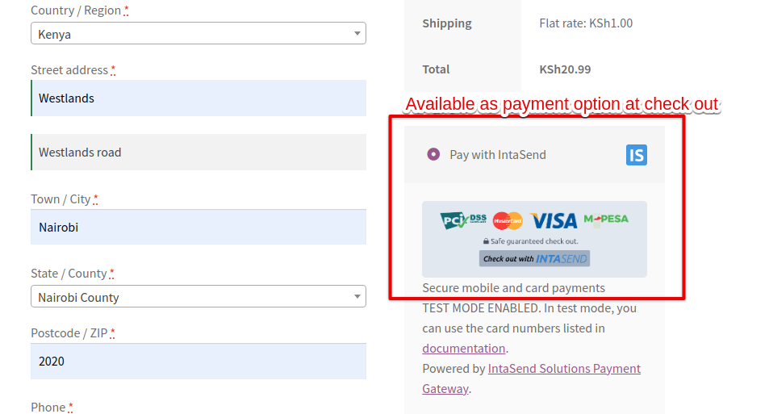

# WooCommerce

IntaSend has built a secure payment gateway to power e-commerce sites. IntaSend is platform is secure and PCI-DSS compliant. We have built tools to make integration easier for businesses and developers.

Ready to add payments to your site? Below is a step-by-step video and guide on how to integrate payment on WooCommerce. Feel free to also test our demo site here [http://54.86.135.148/](http://54.86.135.148).


How to setup and install IntaSend Plugin for WooCommerce


## 1. Download the latest IntaSend WooCommerce Plugin

Follow this link to download our latest plugin - [https://intasend-public-share.s3.eu-central-1.amazonaws.com/intasend-woocommerce-plugin.zip](https://intasend-public-share.s3.eu-central-1.amazonaws.com/intasend-woocommerce-plugin.zip)

## 2. Log in to your WP-Admin and upload the plugin

## 3. Activate the plugin

Click the activate plugin to confirm the installation.

After the activate action, your plugin will be listed under the plugins section. Please confirm if it has been installed correctly as shown in the screenshot below.

## 4. Complete Payments setting in WooCommerce

After activation, the plugin will be automatically be added to your **WooCommerce Settings tab** under the** Payments section**. Please check the screenshot below.

Navigate to the Payments tab and enable the **IntaSend Gateway**.

Obtain your Publishable API key from the IntaSend dashboard.

For testing go to [https://sandbox.intasend.com/account/api-keys/](https://sandbox.intasend.com/account/api-keys/)

For live (production) publishable key [https://payment.intasend.com/account/api-keys/](https://payment.intasend.com/account/api-keys/)

Configure your API Key and account default.

> #### Remember to uncheck the test mode flag in live environment.

## 5 . Test your integration

To test your integration, add items to your cart and proceed to checkout. You should be able to see **Pay with IntaSend** added as your payment method.

Congratulations, your WooCommerce site is now well set up to start receiving payments.
