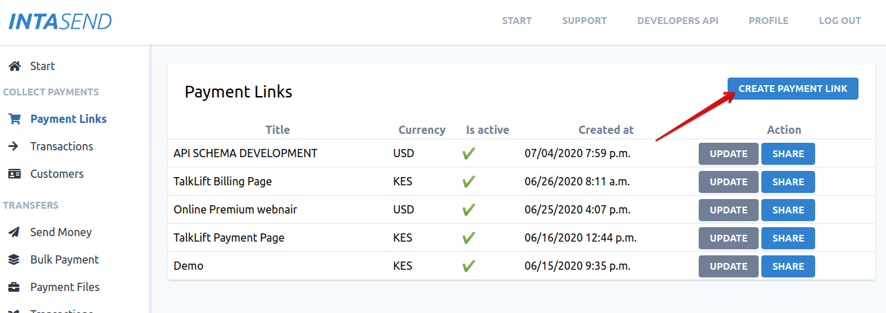
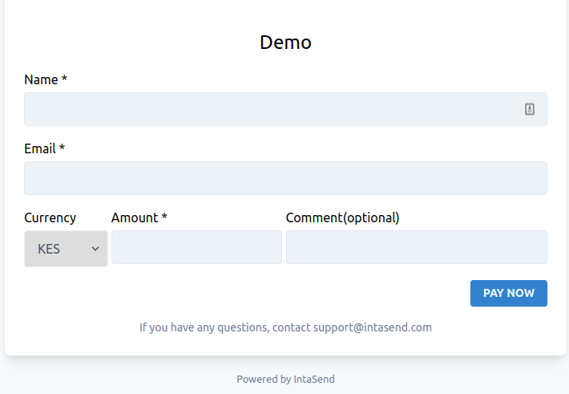
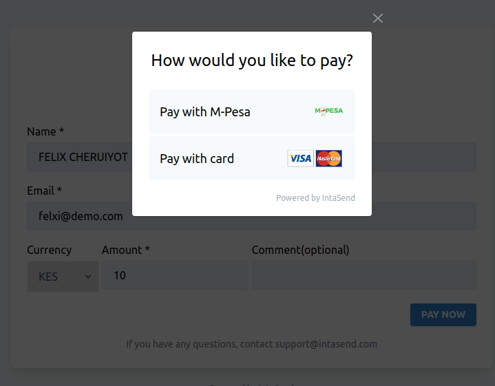
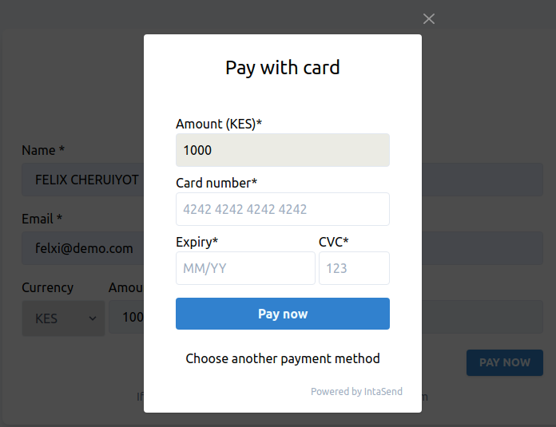
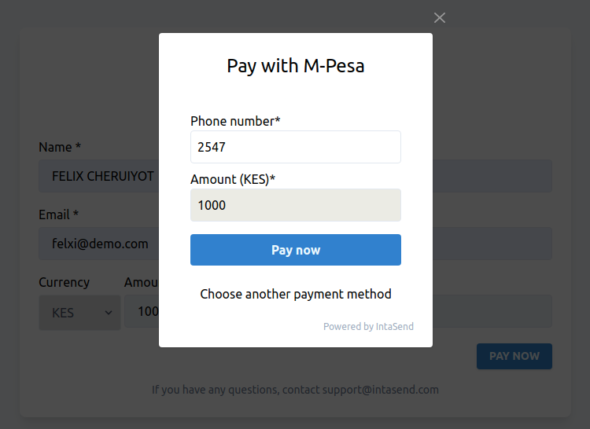

# Payment Links

A payment link is the easiest way to start receiving payments and with zero integration. Simply generate a secure payment link and share it with your customers/users and start collecting payments.

### 1. How to create a payment link

Create your IntaSend business account and navigate to [https://payment.intasend.com/payment-links/new/](https://payment.intasend.com/payment-links/new/) to create a new payment link.

### 2. Share the link and start receiving M-Pesa and Card Payments

The following screenshot shows a sample payment link and customers' journey in making payments.

User fill contact information and initiate payment option screen

Enter card information in case of card payment. Customer clicks **Pay now** to complete.

The customer gets payment status and transaction advice if any.

The M-Pesa payment screen if the user chooses to pay with M-Pesa. Users will automatically be prompted with the M-Pesa STK push with instructions on how to complete payment.

