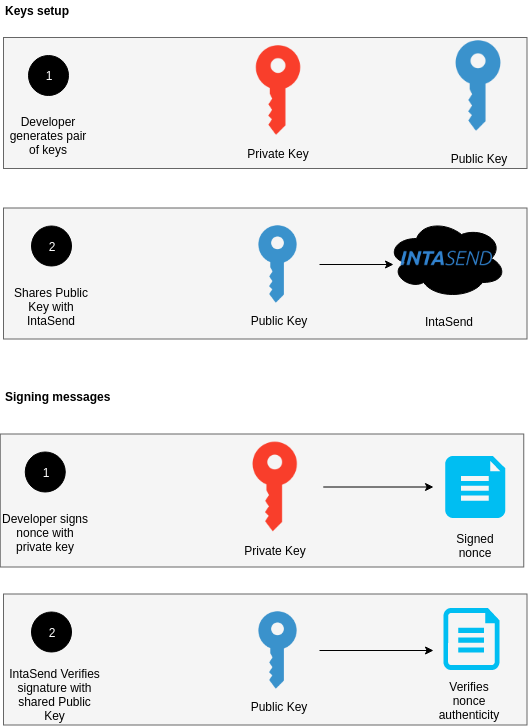

# PSD2 and Digital Keys

To enforce the security of our APIs and ensure that funds can only be moved by an authorized entity, IntaSend recommends that transfer APIs must be initiated and signed before processing.&#x20;

PSD2 standard suggests that payment transactions must be signed and authenticated with at least two steps i.e a password or token, and something that only the merchants know e.g an OTP or a security key.

The following guide breaks down how this should be done and also provide code examples to help you get started. &#x20;

**Note: This procedure is currently mandatory for the Send Money (Disbursement) approval API.**



### How to add setup the public key for your API/Integrating device

### 1. Generate OpenSSL Keys

IntaSend recommends that you generate a private key using RSA and a key size of 2048 bits

#### Option 1 - Online key generator (easier way)

[https://cryptotools.net/rsagen](https://cryptotools.net/rsagen) offers an interface where you can generate a 2048 RSA key. After generating the key pair, copy the public key to the IntaSend dashboard and ensure you keep the private key safe. Do not reveal your private key. [How to add the public key to your IntaSend account.](extra-payment-authentication.md#2.-add-the-public-key-to-your-account)

#### Option 2 - Generate it yourself (OpenSSL)

Generating your private key. This key must never be shared. Must be stored in a secure place and where only your application can access it. You need [openssl](https://www.openssl.org) installed. Most Mac OS and Linux distros have it already installed.

```
openssl genpkey -algorithm RSA -pkeyopt rsa_keygen_bits:2048 -out private-key.pem
```

Use the private key to generate its corresponding public key.

```
openssl pkey -in private-key.pem -out public-key.pem -pubout
```

Copy the content of **public-key.pem** for use in the next session i.e adding to a new API device for signature verifications during requests.

**Addition notes:**

* Learn how to install OpenSSL in windows here [https://tecadmin.net/install-openssl-on-windows/](https://tecadmin.net/install-openssl-on-windows/)
* For Linux systems, most of them come with OpenSSL installed. If none, check this link for installation instructions - [https://www.howtoforge.com/tutorial/how-to-install-openssl-from-source-on-linux/](https://www.howtoforge.com/tutorial/how-to-install-openssl-from-source-on-linux/)

### 2. Add the public key to your account

Navigate to the **API Devices** section under your settings section and add your newly generated **public key**.

.png>)

.png>)

### Reference - More on digital signatures

In the diagram below note, the SecretKey is used to sign the message and the Public key is used to verify the message. IntaSend retains the Public key in its database for verification purposes. You must securely store the private key for signing messages e.g nonce when approving transactions with the API.

.png>)

## OpenSSL libraries

Below is a list of OpenSSL libraries and code examples for various languages.

* [https://www.php.net/manual/en/function.openssl-sign.php](https://www.php.net/manual/en/function.openssl-sign.php)
* [https://pypi.org/project/pyOpenSSL/](https://pypi.org/project/pyOpenSSL/)
* [https://www.npmjs.com/package/node-openssl-cert](https://www.npmjs.com/package/node-openssl-cert)
* [https://www.npmjs.com/package/openssl-nodejs](https://www.npmjs.com/package/openssl-nodejs)

### Code examples



```
import OpenSSL
from OpenSSL import crypto as OpenSSLCrypto

def sign(private_key, message):
    pkey = OpenSSLCrypto.load_privatekey(
        OpenSSLCrypto.FILETYPE_PEM, private_key, None)
    sign = OpenSSL.crypto.sign(pkey, message, "sha256")
    return sign.hex()
    
def verify(public_key, signature_hex, message):
    pkey = OpenSSLCrypto.load_publickey(
        OpenSSLCrypto.FILETYPE_PEM, public_key)
    x509 = OpenSSLCrypto.X509()
    x509.set_pubkey(pkey)
    signed = bytes.fromhex(signature_hex)
    results = OpenSSL.crypto.verify(x509, signed, message, "sha256")
    return results
```


